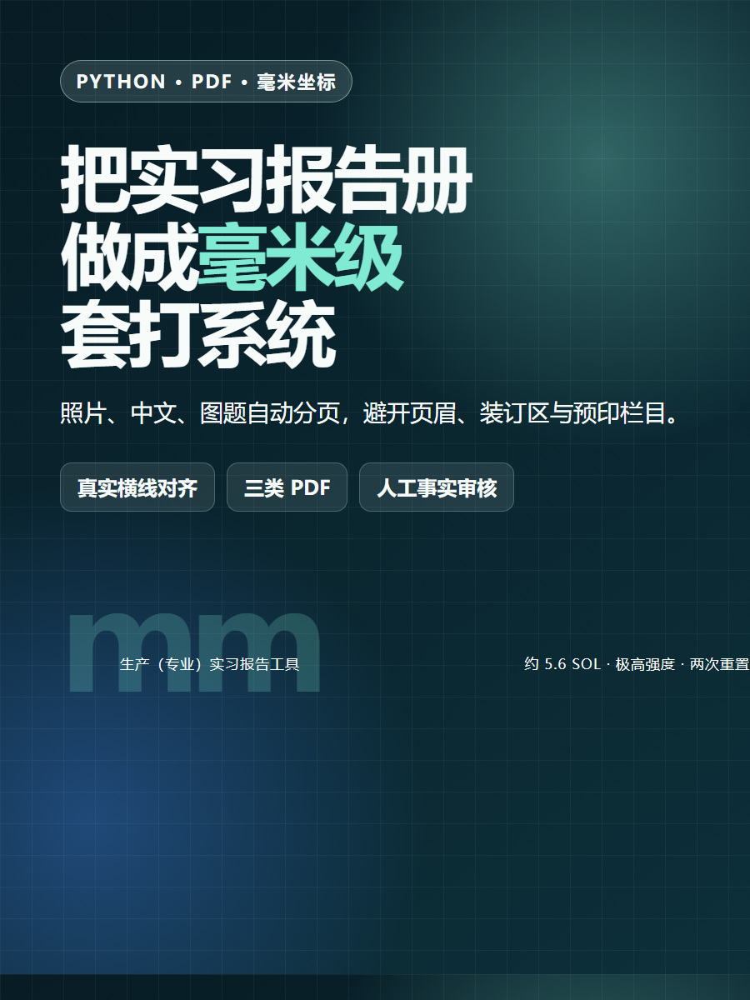
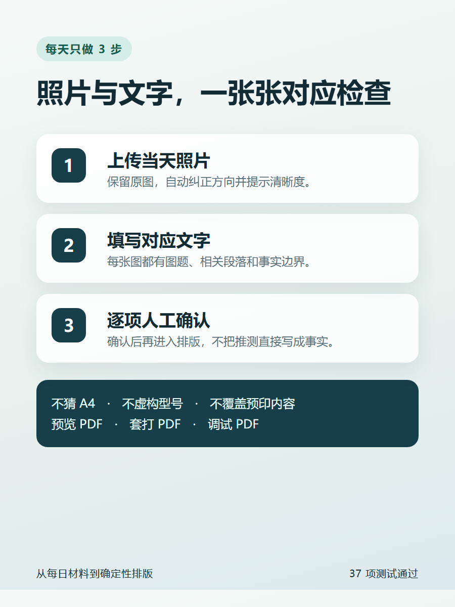
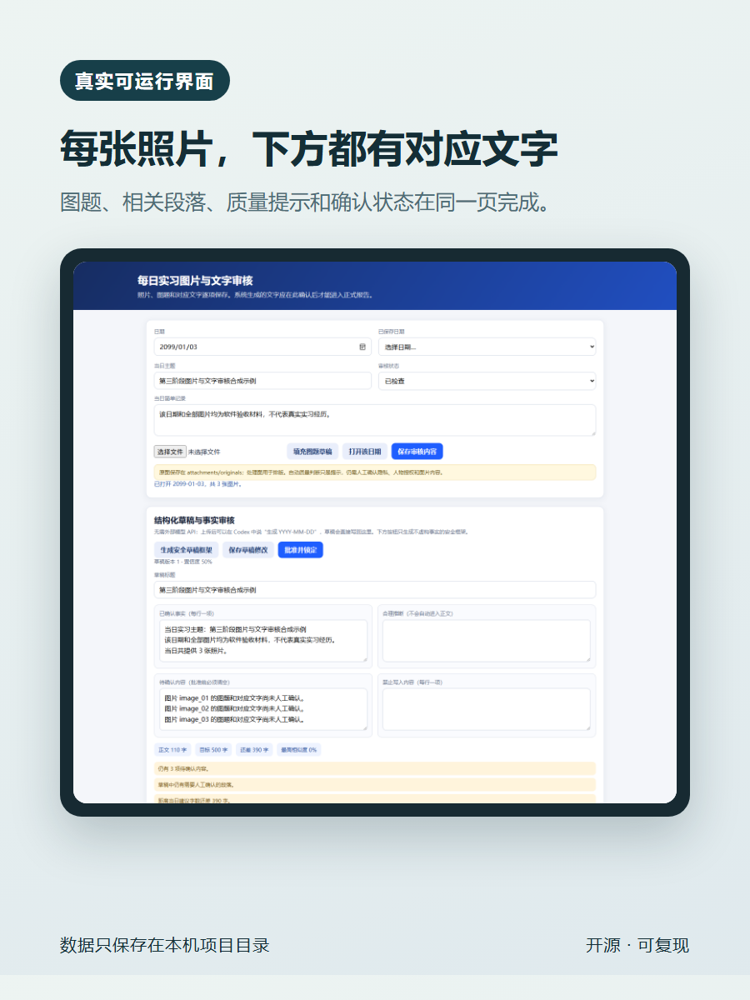

# 生产（专业）实习报告智能生成与精确套打系统

一个面向固定格式实习报告册的本地工具：用用户实测物理尺寸建立毫米坐标，在扫描模板上标定可打印区域，将中文、照片和图题排到对应位置，并输出预览、正式套打和布局调试三类 PDF。

当前已完成第一至第四阶段主体：模板与坐标系统、横线文字排版与分页、图片处理与图文混排，以及每日材料事实分级、结构化草稿、重复/字数检查和人工批准锁定。完整 8000 字总报告、最终目录回填仍属于后续阶段，仓库不会把这些能力伪装成已经完成。

<p align="center">
  
  
  
</p>

## 已实现

- 导入 JPG、PNG、TIFF 和 PDF 模板候选，原文件不覆盖。
- 物理宽高为空时禁止毫米标定和正式套打，不猜测 A4。
- 扫描方向、页面边界、透视与旋转校正接口。
- 正文区、禁止区、图片区、字段和横线的毫米坐标配置。
- 逐条真实横线排版、中文标点感知换行、标题绑定和跨页孤行控制。
- 多模板分页、页码区域、越界与固定区域碰撞检查。
- EXIF 方向纠正、清晰度提示、等比例缩放、单图/双图、边框和连续图号。
- 每日照片上传、逐图图题、对应文字和人工确认状态保存。
- 已确认事实、合理推断、待确认内容和禁止写入内容分级。
- 每日结构化草稿、字数缺口、历史相似度和批准锁定。
- 带模板背景预览 PDF、无背景套打 PDF、坐标调试 PDF。
- 打印机偏移、横纵缩放和旋转补偿基础。

## 关键安全边界

- 《使用注意事项》只属于学校要求资料，绝不作为打印模板。
- 新模板的物理宽高默认为空；PDF 介质框和图片 DPI 只作诊断信息。
- 正式套打 PDF 不包含扫描背景、预印页眉、横线、表格或固定文字。
- 推测内容必须先人工确认，不能直接进入正式文件。
- Git 默认忽略学校资料、真实模板、每日照片、学生信息、打印机配置和所有生成文件，避免误传到公开仓库。

## 安装

Windows PowerShell：

```powershell
git clone <repository-url>
cd internship-report-generator
python -m venv .venv
.venv\Scripts\python -m pip install -r requirements.txt
.venv\Scripts\python cli.py project init
```

启动模板标定界面：

```powershell
.venv\Scripts\streamlit run app.py
```

## 每日图片与文字审核小程序

Windows 下可直接双击：

```text
start_daily_review.cmd
```

也可以从终端启动：

```powershell
.venv\Scripts\python launch_daily_review.py
```

如果双击没有反应，可在项目目录运行 `start_daily_review.cmd` 查看错误提示。仓库通过 `.gitattributes` 强制该启动器使用 Windows CRLF 换行，并保持批处理外壳为 ASCII，避免 `cmd.exe` 因 UTF-8 中文和 LF 换行错误拆分命令。

在页面中选择日期并上传多张照片，每张照片下方可填写图题和对应的生成文字，再逐项勾选确认。原图、处理图和审核结果保存在本机 `days/YYYY-MM-DD/`，不会自动上传。

## 不接外部模型 API 的 Codex 协作流程

本项目不要求 OpenAI API Key。审核网页中的 `/api/...` 只是 `127.0.0.1` 本机读写接口，不会把照片发送到外部模型。

推荐流程：

1. 在审核网页上传当天照片和简单记录。
2. 在当前 Codex 工作区中说“生成 YYYY-MM-DD”。
3. Codex 读取 `days/YYYY-MM-DD/`、近期已批准记录和禁写项，在对话中生成内容。
4. Codex 将简化草稿写回本地；确定性引擎补齐字数、相似度、版本和内容哈希。
5. 在审核网页修改并清空待确认项，最后批准锁定。

对应的本地命令为：

```powershell
.venv\Scripts\python cli.py day context 2026-07-11
.venv\Scripts\python cli.py day import-draft <codex-draft.json>
.venv\Scripts\python cli.py day word-count 2026-07-11
.venv\Scripts\python cli.py day approve 2026-07-11
```

`day draft` 只生成不虚构事实的安全框架；最终自然语言内容可以由当前 Codex 对话生成并写回。

## 模板工作流

导入学校要求资料：

```powershell
.venv\Scripts\python cli.py requirements import <file> --category school_rules
```

导入真正的打印页面扫描件并设置实测尺寸：

```powershell
.venv\Scripts\python cli.py template add <scan_file> --template-id lined_content_page
.venv\Scripts\python cli.py template set-size lined_content_page --width-mm 185 --height-mm 260 --orientation portrait --binding-side left
.venv\Scripts\python cli.py template correct lined_content_page
.venv\Scripts\python cli.py template calibrate lined_content_page
```

人工确认源图四角时，顺序为 TL、TR、BR、BL：

```powershell
.venv\Scripts\python cli.py template correct lined_content_page --corners-px 20,30,2470,25,2460,3480,18,3475
```

只有扫描图边界已经确认就是纸张边界时，才使用 `--use-full-frame`。

横线检测结果默认只是建议；加 `--apply` 才写入配置：

```powershell
.venv\Scripts\python cli.py template detect-lines <template_id>
.venv\Scripts\python cli.py template detect-lines <template_id> --apply
```

## 三类 PDF

- `outputs/previews/`：扫描背景与新增内容，用于目检。
- `outputs/print/`：只含新增内容，用于原报告纸套打。
- `outputs/debug/`：坐标、区域、横线、基线、图片框和打印补偿。

正式打印应选择“实际大小 / 100%”，关闭“适合页面”“缩小过大页面”和自动居中，并先用普通纸试打。

## 合成验收

演示脚本使用明确标记的 `120 × 180 mm` 合成页面，只验证软件行为，不代表任何学校报告纸：

```powershell
.venv\Scripts\python scripts/generate_phase1_example.py
.venv\Scripts\python scripts/generate_phase2_example.py
.venv\Scripts\python scripts/generate_phase3_example.py
.venv\Scripts\python scripts/render_phase3_verification.py
.venv\Scripts\python -m pytest -q
```

当前验收结果：37 项测试通过；三类第三阶段示例 PDF 页数和物理尺寸一致，正式版不含模板背景；第四阶段 HTTP 草稿与批准流程通过。

## 当前限制

- 没有用户实测纸张宽高时，不能给出正式精确套打结论。
- 自动横线和表格检测只能作为初始建议，仍需人工校准。
- 自动安全框架不会凭照片虚构事实；自然语言扩写由 Codex 在当前工作区读取材料后完成。
- 完整 8000 字总报告、目录页码回填、全文重复度与事实一致性检查尚未完成。

## License

[MIT](LICENSE)
